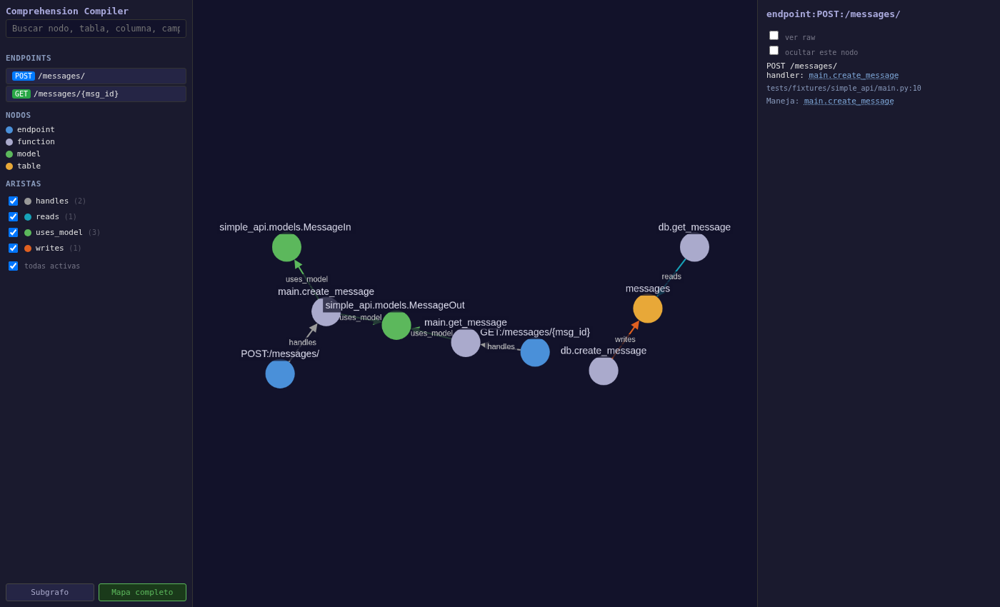

# Comprehension Compiler (FASTDelphos)

Reads a FastAPI repo, extracts its structure **deterministically** (no LLM, no guessing), and compiles it into a navigable property graph — rendered as a self-contained interactive HTML page. It's not a documentation generator: the point is to answer "where does X happen?" faster by clicking through the graph than by grepping and reading source.



## Why

Onboarding a new codebase (or an auditor reviewing one) usually means grepping for a name, opening five files, and mentally rebuilding the call chain. This tool builds that chain once, as data, and gives you a UI to walk it: click an endpoint, see everything it reaches; click a table, see who writes to it and from which exact line.

Two rules shape everything it does:

- **Deterministic first.** `cc compile` uses zero LLM calls — everything comes from parsing the source (`ast`, `griffe`, `sqlglot`). An optional second step, `cc annotate` (see [LLM why-notes](#llm-why-notes-cc-annotate)), can add LLM-generated why-notes on top — always visually marked `inferred=true`, in a separate overlay file, never mixed into the deterministic graph.
- **Flag, don't guess.** When something can't be extracted from source (a table with no `CREATE TABLE` anywhere, a call resolved only at runtime via `Depends()`), the tool never invents an answer — it declares a **gap**, visible in the output, with a suggested fix where one makes sense.

## Quick start

```bash
python -m venv .venv
source .venv/bin/activate
pip install -e ".[dev]"

cc compile /path/to/a/fastapi/repo --out ./output/myrepo
```

Open `./output/myrepo/index.html` in a browser — it's a single static file, no server required for local use.

**Working over SSH with no desktop** (e.g. a headless dev box, VS Code Remote-SSH from Windows/Mac): add `--serve` and it compiles, then serves the output over HTTP on `127.0.0.1` until you hit Ctrl+C — VS Code's automatic port forwarding picks it up the same way it does for a local dev server.

```bash
cc compile /path/to/repo --out ./output/myrepo --serve --port 8642
# → Sirviendo ./output/myrepo en http://localhost:8642 — Ctrl+C para parar
```

If the `.venv` from Quick start isn't already active in your shell (e.g. a fresh SSH session), activate it first or call the module directly — both are equivalent to the `cc` console script:

```bash
source .venv/bin/activate
python -m cc compile /path/to/repo --out ./output/myrepo --serve --port 8642
```

The output is a fully self-contained static bundle (Cytoscape vendored inline, no network calls) — if it's already compiled and you just want to view it, you don't need `cc`, the venv, or even this repo checked out. Any static file server works, e.g. stdlib `http.server` from inside the output directory:

```bash
cd ./output/myrepo
python3 -m http.server 8642 --bind 127.0.0.1
```

## What you get

A graph of four node types and five edge types — small enough vocabulary to hold in your head, big enough to answer real questions.

**Nodes:**

| Type | Color | What it is |
|---|---|---|
| `endpoint` | 🔵 blue | A FastAPI route — method, path, and its handler function |
| `function` | ⚪ grey | A function or method, `is_handler` marks whether it's directly wired to a route |
| `model` | 🟢 green | A Pydantic model — its `fields[]`, name and type each |
| `table` | 🟠 orange | A DB table inferred from `CREATE TABLE` / `INSERT` / single-table `SELECT` — its `columns[]` |

**Edges:**

| Type | Meaning |
|---|---|
| `handles` | endpoint → its handler function |
| `calls` | function → function it calls (resolved via `ast` + a griffe symbol inventory — see [`doc_proyecto/VISITOR.md`](doc_proyecto/VISITOR.md) for exactly which call shapes are resolved and why) |
| `uses_model` | endpoint → request/response model, direction-tagged (`in`/`out`) |
| `reads` / `writes` | function → table, with `via` pointing at the exact `file:line` of the SQL call site |

Every node/edge is `inferred: false` in this phase — everything you see was read from source, not guessed.

## Using the UI

- **Search box** (top of the sidebar) — substring, case-insensitive, matches node names *and* what's inside them: a model's field names, a table's column names. Searching `cost_usd` lands you on the table that has that column, not just on tables in general. Click a result to jump straight to it.
- **Node panel** (right side, click any node) — humanized props per node type, `file:line`, and its neighborhood as clickable sentences ("Llama a: ...", "Escrita por: ..."), each with `via` for DB edges. A "ver raw" toggle reveals the underlying JSON if you need it.
- **Hub badge** — a node whose in-degree crosses a relative threshold (15% of all functions, floor of 5) gets flagged `⚠ hub — N llamantes`, so a shared low-level helper (a DB connection getter, say) doesn't get treated like normal application logic.
- **"Alcanzable desde"** — for any non-endpoint node, which endpoints can reach it, computed by walking the call graph backward. The walk stops at hub nodes (see above) so this doesn't degenerate into "every endpoint reaches everything" just because everything eventually touches a shared helper.
- **Ocultar nodo** — hide a node from the current session's view (useful for noisy nodes while you explore); resets on page reload, nothing is persisted.
- **Subgrafo / Mapa completo** — start from one endpoint's reachable subgraph (the default), or see the whole compiled graph at once. Double-click any node to pull in its immediate neighbors.

## Excluding files

Two layers, always. A fixed set — `.venv`, `__pycache__`, `.git`, `node_modules`, `.tox`, `dist`, `build` — is never walked, on every run, not configurable: it's vendor/tooling, never a candidate for "this repo's own source" in the first place.

On top of that, `--exclude PATTERN` (repeatable, glob relative to the repo root) drops your own content — most commonly a test suite that would otherwise pollute the call-graph coverage numbers with test-only helpers and mocks:

```bash
cc compile /path/to/repo --out ./output/repo --exclude 'backend/tests/**'
```

Default is no content exclusions — explicit over implicit, nothing is silently dropped unless you ask for it. Excluded files disappear from the graph entirely: no nodes, no edges, no gaps, and they don't count toward coverage. Anything a *non-excluded* file calls into that lives in an excluded file resolves as `unresolved_dynamic` rather than a broken reference — the tool never points at code that isn't there.

Active patterns and their matched-file counts are visible in the sidebar (top, under the title) and in `graph.json`'s `exclusions` field, so an exclusion is always declared, never silent.

**The target repo's own `.gitignore` is respected by default** (root + nested ones in subdirectories) — reuses the exact same exclusion set as `--exclude` above, so a file matched by either never appears in the graph, and both show up in the same declared exclusions report. No `git` binary or `.git` directory required — it's read as plain text via [`pathspec`](https://github.com/cpburnz/python-pathspec), never the machine's global gitignore or `.git/info/exclude` (those don't travel with the source, and using them would make output depend on who's running the tool). Pass `--no-gitignore` to turn it off and fall back to exactly `--exclude`'s behavior:

```bash
cc compile /path/to/repo --out ./output/repo --no-gitignore
```

## Gaps — what the tool won't guess

When source doesn't have the answer, the tool says so instead of inventing one. Three kinds, each aimed at a different audience:

- **`missing_artifact`** — the information genuinely isn't in the source (a table referenced in SQL with no `CREATE TABLE` anywhere). Actionable: add the missing artifact.
- **`unresolved_dynamic`** — the information exists, but only at runtime (`Depends()`, `getattr`, dispatch by dict). Not a defect — the code works fine, static analysis just can't see through it. Not something you're asked to fix.
- **`tool_limitation`** — the information *is* in the source, but this version of the tool can't parse that particular shape. Transparency about coverage, not a claim about the repo.

Each gap carries a severity per audience — `comprehension` (is the graph still useful?) and `compliance` (can an auditor trust it?) — because the same gap can be a shrug for one and a blocker for the other.

## How it's built

```
adapter (fastapi) → extractors → graph build → gaps → render
```

- **Extractors** (`src/cc/extract/`) are independent and deterministic: `endpoints.py` (routes), `models.py` (Pydantic via `griffe`), `calls.py` (call graph via `ast` + `griffe`), `sql.py` (tables/columns via `sqlglot`).
- **Graph build** assigns each node a stable `id` (derived from qualname + path — survives body edits) and a content `hash` (changes on edit; the anchor for a future hash-gated LLM-annotation phase).
- **Gaps** are computed once the graph exists, per the taxonomy above.
- **Render** (`src/cc/render/`) emits a single self-contained HTML file — Cytoscape.js and its dagre layout extension are vendored inline, so the output has zero network dependencies and zero build step.

## Development

```bash
pytest                        # 285 tests, no JS runner (the render UI has no
                               # browser test harness — real verification during
                               # development is a throwaway Playwright script,
                               # not part of the committed suite)
ruff check . && ruff format .
```

Design history lives in `doc_proyecto/` (the original schema contract, `ESQUEMA_POC.md`) and `docs/superpowers/` (specs and implementation plans for everything built after the initial POC, in chronological order — useful if you want to see *why* a given piece of resolution logic exists, not just what it does).

## Benchmarking against ground truth (`--oracle`)

The extractor never imports the repo it's analyzing — it only parses source (`ast`, `griffe`, `sqlglot`). That's non-negotiable for a real target, since importing untrusted app code can execute arbitrary module-level side effects and may require secrets/infra the tool has no business touching.

`--oracle` is a **narrow, opt-in exception for measuring the extractor itself**, not something you'd run against a client repo:

```bash
cc compile /path/to/repo --oracle
# → Route recovery: 18/18 (100%)
```

It boots the target app for real (`app.openapi()`, which resolves mounted sub-routers) and asks it directly what routes are registered at runtime — that's the ground truth. It then diffs that list against what the static extractor found, and prints the recovery rate plus any routes the static pass missed.

Use it only against a repo you're comfortable importing locally (it boots clean with no real secrets/infra — a throwaway dev copy or a test fixture, never a repo carrying production credentials). It's how this project validates its own coverage, not a feature for auditing someone else's code.

## LLM why-notes (`cc annotate`)

Everything above is Phase 1: zero LLM, deterministic only. `cc annotate` is a separate, **opt-in** command layered on top of an already-compiled graph — it never touches `cc compile` or `graph.json`. Without any `CC_LLM_*` config set, the tool behaves exactly as described above; nothing about Phase 1 changes if you never run it.

```bash
cc compile /path/to/repo --out ./output/repo
cc annotate ./output/repo
```

It reads `graph.json`, generates one short "why does this exist" note per node via an LLM, and writes them to a **separate overlay file**, `notes.json`, next to the compiled output — never merged into `graph.json` itself, so the deterministic graph stays byte-identical whether or not you ever run `cc annotate`, and a compliance audience can be handed the graph alone. Every note is hash-gated: it's tied to the `hash` of the node it was generated from, and only regenerates when that hash actually changes (`--force` to regenerate anyway). Notes render inline in the node panel for `function`/`endpoint` nodes, visually marked as LLM-generated (never mixed in with deterministic content unlabeled) — but only when the output is served over HTTP (`--serve`, or any static file server); opening `index.html` via `file://` can't `fetch()` a sibling JSON file, so it degrades gracefully to "no notes" rather than failing.

By default, `cc annotate` covers every `endpoint` plus every "orchestrator" `function` (≥2 outgoing calls or ≥2 distinct tables touched) — the nodes most worth a one-line "why," not every leaf helper. Narrower or broader scope:

```bash
cc annotate ./output/repo --node function:backend.services.synthesis.build_context  # one node, on-demand
cc annotate ./output/repo --all                                                     # every node
```

Configure via a `.env` file in the working directory (or real environment variables, which win over `.env` — same precedence as pods/CI expect) with a `CC_LLM_*` prefix. Two providers:

```bash
# Anthropic (direct SDK)
CC_LLM_PROVIDER=anthropic
CC_LLM_API_KEY=sk-...
CC_LLM_MODEL=claude-haiku-4-5       # optional, this is the default

# Any OpenAI-compatible gateway (local model server, corporate LLM gateway, ...)
CC_LLM_PROVIDER=openai_compatible
CC_LLM_BASE_URL=http://localhost:11434/v1   # full base URL including /v1 — the client appends /chat/completions
CC_LLM_API_KEY=...                          # optional — many local dev servers don't need one
CC_LLM_MODEL=qwen2.5-coder                  # required for this provider — no cross-provider default

# Optional, either provider:
CC_LLM_MAX_TOKENS=500                # a why-note is a paragraph, not an essay (default 500)
CC_LLM_EXTRA_INSTRUCTIONS=           # extra per-provider prompt instructions (smaller models often need stricter prompts)
CC_LLM_ORCHESTRATOR_THRESHOLD=2      # the ">=N" in the default-scope rule above
```

The `openai_compatible` provider is a thin `httpx` client against `POST {base_url}/chat/completions` — no vendor SDK, so it works against any gateway speaking the OpenAI chat-completions shape (Ollama, vLLM, a corporate gateway). The API key never appears in logs, in the compiled output, or in error messages — every failure is wrapped down to just its exception type name. See `scripts/openai_smoke_test.py` for a manual, never-automated connectivity check (including notes on Azure-style `api-key` header naming vs. this client's Bearer-only support, and internal TLS CA setup via `SSL_CERT_FILE`/`SSL_CERT_DIR`).

## Status

**Phase 1** (FastAPI adapter, fully static, zero LLM): complete, validated against a real multi-router FastAPI + MariaDB target — **18/18 routes recovered (100%)** via `--oracle`.

**Phase 2** (`cc annotate` — LLM why-notes, hash-gated, opt-in): complete — both the `anthropic` and `openai_compatible` providers are implemented (see [LLM why-notes](#llm-why-notes-cc-annotate) above).

Hardened against a second real target beyond agora (a multi-router corporate repo): endpoint identity now survives two routers declaring the same apparent route from different namespaces (flagged as a gap, not a crash), and the target's own `.gitignore` is respected by default.

Not started, no timeline: a `generic` adapter — static analysis for non-FastAPI repos, interchangeable with the LLM option without touching anything in Phase 1.

## Glossary

Terms used across this README and the codebase — the graph model, the resolution pipeline that fills it, and the libraries doing the work. For UI-specific jargon (hub badge, "Alcanzable desde") see [Using the UI](#using-the-ui); for gap severities see [Gaps](#gaps--what-the-tool-wont-guess).

**Graph model**

| Term | Meaning |
|---|---|
| Node | One graph vertex — `endpoint`, `function`, `model`, or `table`. Carries a stable `id`, a content `hash`, `inferred`, `file:line`, and type-specific `props`. |
| Edge | A typed relationship between two nodes — `handles`, `calls`, `uses_model`, `reads`/`writes`. |
| `id` | Stable node identity, derived from qualname + path (e.g. `function:agora.services.synthesis.build_context`). Survives edits to the function body — it's the anchor used to track "the same node" across recompiles. |
| `hash` | Content fingerprint of the node's source span. Changes whenever the underlying code changes; the anchor a future LLM-annotation phase would use to decide "regenerate or reuse the cached note". |
| `inferred` | `false` for everything in this phase — every field came from parsing source, never from a model. Reserved for a future phase where LLM-generated content gets flagged this way instead of mixed in silently. |
| Gap | A declared "the tool doesn't know this" instead of a guessed answer. Three kinds: `missing_artifact` (the info isn't in the source anywhere — actionable, ask a dev to add it), `unresolved_dynamic` (the info only exists at runtime — not a defect, nothing to fix), `tool_limitation` (the info *is* in the source, this version just can't parse that shape). |
| Hydrate / hydration | Turning a resolved reference (a bare qualname) into a full `Node` — file, line, `hash`, `props`. A call can resolve *structurally* (the visitor knows what it points to) without being hydratable — e.g. griffe can't locate the symbol's actual source (a namespace package, a compiled stub). It still counts toward coverage; it just can't be rendered as a node/edge. |

**Resolution pipeline**

| Term | Meaning |
|---|---|
| Adapter | The layer that knows what counts as an entry point for a given framework. Phase 1 has one: `fastapi` (a route = an endpoint). |
| Extractor | An independent, deterministic pass turning source into one kind of node/edge — `endpoints.py`, `models.py`, `calls.py`, `sql.py`. |
| `resolved_internal` | A call resolved to a function living inside the target repo — becomes a `calls` edge. |
| `resolved_external` | A call whose target positively resolves to a package outside the repo's own top-level packages (stdlib, third-party). No edge, no gap — just an aggregate per-file count in the coverage report. Not knowing what a call is never counts as external; external is a positive conclusion, not an absence of resolution. |
| `unresolved_dynamic` (resolution bucket) | The default when a call site can't be classified as internal or external — attribute chains, `getattr`, dict dispatch, `Depends(...)`. No gap is raised for this bucket; it's expected, not a defect. |
| Coverage | The report of call sites resolved vs. unresolved, per file and aggregated — treated as a product metric (and, in a Corporate context, a lineage-completeness number), not a debug artifact. |
| Oracle (`--oracle`) | A narrow, opt-in benchmark mode that boots the target app for real (`app.openapi()`) and diffs its actual registered routes against what static extraction found. Validates the extractor itself against a trusted target (agora) — not a tool for auditing third-party code. |

**Libraries**

| Term | Meaning |
|---|---|
| `griffe` | Static Python symbol inventory — builds a queryable table of qualnames, signatures, and source locations without importing the code. The resolver behind `models.py` and the call graph: the AST visitor in `calls.py` doesn't keep its own symbol table, it queries griffe's. |
| AST / `ast` | Abstract Syntax Tree — a tree representation of source code, one node per language construct (a call, an assignment, an `if`, an import), instead of raw text. `ast` is the Python stdlib module (`import ast`) that parses `.py` files into this tree; `calls.py` walks it (`ast.parse()` + `ast.walk()`) to find `ast.Call` and `ast.Import`/`ast.ImportFrom` nodes. What makes it matter for this project: it reads structure without ever running the code — no side effects, no secrets, no infra — which is exactly the "source-only, zero infra" principle (the one deliberate exception is `--oracle`, which does import the target app, but only as an opt-in validator). |
| `sqlglot` | SQL parser used by `sql.py` to pull table/column names out of raw queries (`CREATE TABLE`, `INSERT`, single-table `SELECT`). |
| Cytoscape.js / dagre | The graph rendering library and its hierarchical layout extension, vendored inline into the compiled HTML — zero CDN dependency at view time. |
